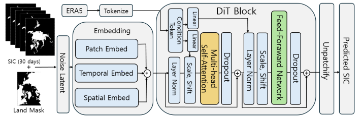

# SIC Prediction with Diffusion Transformer

> **Diffusion Transformer를 이용한 해빙 농도 변화 추세 예측 모델**  
> Image Processing and Understanding Workshop (IPIU) 2026

<p>
  <a href="./paper.pdf">Paper</a>
</p>


## Overview

본 연구는 해빙 농도(Sea Ice Concentration, SIC) 예측을 기존의 단일 시점 회귀 문제에서 벗어나, 시간에 따라 변화하는 미래 해빙 상태를 연속적으로 생성하는 시공간 생성 문제로 재정의합니다.

이를 위해 과거 해빙 농도와 기후 환경 정보를 조건으로 활용하는 Diffusion Transformer 기반 순차 예측 프레임워크를 제안합니다. 제안 모델은 미래 해빙 상태를 일 단위로 생성하며, 장기 예측 과정에서 나타나는 공간적 변화와 시간적 연속성을 함께 모델링합니다.

<p align="center">
  
</p>


## Motivation

기존 해빙 농도 예측 방법은 주로 특정 미래 시점의 상태를 직접 예측하는 방식으로 구성됩니다. 이러한 접근은 다음과 같은 한계를 가집니다.

- 중간 시점의 변화를 명시적으로 모델링하기 어려움
- 해빙 농도의 연속적인 변화 추세를 충분히 반영하지 못함
- 여름철과 같이 해빙 변화가 급격한 구간에서 예측 성능이 저하될 수 있음
- 장기 예측 시 시간적 일관성과 안정성을 유지하기 어려움

본 연구에서는 해빙 농도 예측을 조건부 생성 문제로 확장하고, 미래 상태를 순차적으로 생성함으로써 해빙의 시공간적 변화 과정을 모델링합니다.


## Method

### 1. Diffusion Transformer-based Forecasting

해빙 농도 예측을 미래 상태의 확률 분포를 학습하는 생성 문제로 정의합니다.

Diffusion 과정에서는 실제 미래 해빙 상태에 노이즈를 추가하고, 모델이 이를 점진적으로 제거하도록 학습합니다. Denoising backbone으로 Diffusion Transformer를 사용하여 해빙 영상 내 전역적인 공간 의존성과 시간에 따른 변화 패턴을 학습합니다.

### 2. Multi-modal Conditional Information

모델은 다음 정보를 조건으로 활용합니다.

- 과거 30일의 해빙 농도 데이터
- ERA5-Land 기반 기후 환경 데이터

조건 정보는 Adaptive Layer Normalization(adaLN)을 통해 Transformer block에 주입됩니다. 이를 통해 과거 해빙 상태와 환경적 요인이 denoising 과정 전반에 반영되도록 구성했습니다.

### 3. Autoregressive Sequential Generation

모델은 미래 해빙 상태를 일 단위로 순차적으로 생성합니다.

각 시점에서 생성된 결과는 다음 시점의 입력으로 사용되며, 이를 반복하여 장기 해빙 농도 변화 추세를 예측합니다.

```text
Past SIC and climate conditions
        ↓
Diffusion Transformer
        ↓
Predicted SIC at t+1
        ↓
Input for the next prediction step
        ↓
Predicted SIC at t+2, t+3, ...
```

### 4. Long-term Roll-out Fine-tuning

Autoregressive prediction에서는 이전 시점의 오차가 다음 입력에 포함되면서 장기적으로 누적될 수 있습니다.

이를 완화하기 위해 일정 구간의 prediction roll-out을 수행한 후, 전체 예측 구간의 오차를 기반으로 모델을 추가 학습하는 fine-tuning 전략을 적용했습니다.

이를 통해 장기 예측에서의 오차 누적을 줄이고, 시간적 일관성과 예측 안정성을 개선하고자 했습니다.


## Dataset

### Sea Ice Concentration

- Source: NOAA
- Period: 2011–2022
- Target: Daily Sea Ice Concentration
- Preprocessing: Land-area masking

### Climate Conditions

- Source: ERA5-Land
- Usage: Conditional environmental information


## Experimental Setup

| Configuration | Value |
|---|---:|
| GPU | NVIDIA RTX A6000 |
| Epochs | 150 |
| Batch size | 30 |
| Evaluation metric | RMSE (%) |


## Results

제안 모델은 장기 예측과 계절 변화가 큰 구간에서도 안정적인 해빙 농도 예측 성능을 보였습니다.

- 2024년 평균 RMSE: **14.51%**
- Autoregressive fine-tuning 적용 후 약 **1–3% 성능 개선**
- 장기 roll-out 과정에서의 오차 누적 감소
- 급격한 계절 변화 구간에서도 안정적인 예측 성능 유지
- 미래 해빙 상태의 연속적인 변화 추세 모델링


## Main Contributions

1. **Problem Reformulation**  
   해빙 농도 예측을 단일 시점 회귀 문제가 아닌, 미래 상태를 순차적으로 생성하는 조건부 생성 문제로 재정의했습니다.

2. **Diffusion Transformer-based Spatiotemporal Forecasting**  
   Diffusion Transformer를 활용하여 해빙 농도의 전역 공간 구조와 시간적 변화 패턴을 함께 모델링했습니다.

3. **Climate-aware Conditioning**  
   과거 해빙 농도와 기후 환경 데이터를 Adaptive Layer Normalization을 통해 모델에 조건으로 주입했습니다.

4. **Long-term Forecast Stabilization**  
   Autoregressive roll-out 과정에서 발생하는 오차 누적을 완화하기 위한 fine-tuning 전략을 적용했습니다.


## Authors

- 정예준
- 김동윤
- 박진선

Pusan National University


## Citation

```bibtex
@inproceedings{jung2026sic,
  title     = {Diffusion Transformer를 이용한 해빙 농도 변화 추세 예측 모델},
  author    = {정예준 and 김동윤 and 박진선},
  booktitle = {Image Processing and Understanding Workshop},
  year      = {2026}
}
```

```text
정예준, 김동윤, 박진선.
"Diffusion Transformer를 이용한 해빙 농도 변화 추세 예측 모델."
Image Processing and Understanding Workshop (IPIU), 2026.
```
